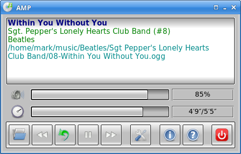

# AMP

“Another Music Player” provides a basic but useful example of Rust/FLTK and
the Soloud sound library.

It should be especially handy for audio books since at startup it restores
the last played track at the exact position it had reached.

Tested on Linux and Windows.

`amp.exe` *is a precompiled Windows binary that should run on any
64-bit version of Windows* (2.5MB; MD5 75252bde921917a5b21baf849d056fa1)

## Dependencies

Rust; see Cargo.toml for third-party crates.

## License

GPL-3.0.

## Other Free Software

[www.qtrac.eu](https://www.qtrac.eu/sitemap.html#foss).
